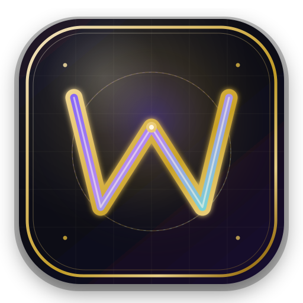

<div align="center">



# WAN Super App

**Satu shell Electron. Empat modul kelas produksi. Nol ribet.**

CLIProxyAPI desktop (Chat · Cowork · Neuron · VS Code / JetBrains), WAN NET
(Cloudflare tunnel + inspector), dan WANN SSH (SSH client + encrypted vault)
dan WAN Mindmap berpadu dalam satu aplikasi native yang elegan.

<br/>


</div>

---

## Daftar Isi

- [Sekilas](#sekilas)
- [Fitur Utama](#fitur-utama)
- [Requirements](#requirements)
- [Instalasi & Menjalankan](#instalasi--menjalankan)
- [WAN Router Cloud Lokal](#wan-router-cloud-lokal)
- [Scripts](#scripts)
- [Arsitektur Singkat](#arsitektur-singkat)
- [Struktur Direktori](#struktur-direktori)
- [Data & Konfigurasi](#data--konfigurasi)
- [Catatan Teknis](#catatan-teknis)
- [🚀 Commit, Push & Release](#-commit-push--release)
- [Auto-Update In-App](#auto-update-in-app)
- [Troubleshooting](#troubleshooting)
- [Referensi CI/CD](#referensi-cicd)
- [Aturan Praktis Tim](#aturan-praktis-tim)
- [License](#license)

---

## Sekilas

WAN Super App membungkus **empat aplikasi mandiri** ke dalam satu shell Electron:

| Modul | Berbasis | Kemampuan |
|-------|----------|-----------|
| **WANN X RENN CLIProxyAPI** | `wan-cliproxyapi` | Chat AI, Cowork Mode, Neuron Activity, sinkronisasi VS Code / JetBrains |
| **WAN NET** | `wan-net` | Cloudflare Tunnel + inspector lalu-lintas |
| **WANN SSH** | `wann-ssh` | SSH client + encrypted vault (Argon2id + AES-256-GCM), TOFU host-key, terminal xterm.js, sync cloud opsional (Firebase **Realtime Database**) |
| **WAN Mindmap** | `mindmap-app` | Visual workspace, offline cache, Firebase Auth, Firestore metadata, dan RTDB canvas sync |

> **Alur pemakaian:** Buka app → **Hub** (4 kartu) → pilih modul → UI modul berjalan di shell Electron yang sama.

Arsitektur lengkap ada di **[HANDBOOK-WAN-SUPER-APP.md](./HANDBOOK-WAN-SUPER-APP.md)**.

Target arsitektur dan relasi tugas **WAN Cliproxy Local + WAN Router Cloud** ada
di **[modules/cliproxy/HANDBOOK-WAN-ROUTER-CLOUD.md](./modules/cliproxy/HANDBOOK-WAN-ROUTER-CLOUD.md)**.

Foundation development Router Cloud sekarang tersedia sebagai service mock
terisolasi dan web console Firebase. Foundation tersebut belum production MVP;
lihat status checkpoint di handbook dan petunjuk di
**[services/wan-router/README.md](./services/wan-router/README.md)**.

---

## Fitur Utama

- 🧩 **Tiga modul, satu binary** — tidak perlu memasang tiga aplikasi terpisah.
- 🪟 **Hub terpusat** — landing dengan tiga kartu modul, dukungan mode window/replace.
- 🔐 **SSH aman** — vault zero-knowledge (Argon2id + AES-256-GCM), auto-lock, TOFU host-key.
- 🧠 **Mindmap visual** — canvas kaya fitur, cache lokal, dan Firebase sync opsional.
- 🔄 **Auto-update in-app** — feed langsung dari GitHub Releases.
- 🖥️ **Cross-platform** — macOS (arm64), Windows (NSIS), Linux (AppImage/deb).
- 🎨 **Branding premium** — ikon monogram + tray template icon adaptif dark/light.
- ⚙️ **Vendor sync** — snapshot read-only sumber modul agar mudah diperbarui.

---

## Requirements

| Komponen | Versi |
|----------|-------|
| Node.js  | **22.12+** (Electron 43) |
| OS       | macOS · Windows · Linux |
| Electron | `^43` (dikelola otomatis) |

> **Native module (WANN SSH → `argon2`).** Paket `argon2` membawa prebuild N-API
> (ABI-stabil), jadi CI/packaging **tidak** rebuild dari source
> (`electron-builder.yml` → `npmRebuild: false`). Untuk development lokal, cukup
> `npm install`; jika prebuild gagal load, barulah toolchain C++ diperlukan
> (macOS Xcode CLT · Windows VS Build Tools · Linux build-essential).

---

## Instalasi & Menjalankan

```bash
# 1. Masuk folder proyek
cd wan-super-app

# 2. Pasang dependency
npm install

# 3. Build seluruh bagian (main + renderer)
npm run build

# 4. Jalankan
npm start
```

### Mode Pengembangan (HMR)

```bash
npm run dev
```

> `npm run dev` menjalankan Vite dual (hub + cliproxy renderer) bersama Electron dengan hot-reload.

---

## WAN Router Cloud Lokal

Tutorial ini menjalankan alur development lengkap:

```text
Browser :5178 → WAN Router :8080 → CLIProxyAPI :8317 → provider AI
                         ├── Firebase Auth Emulator :9099
                         └── PostgreSQL :55432
```

> Konfigurasi ini khusus development lokal, bukan deployment production. Biarkan
> proses pada setiap terminal tetap berjalan selama dashboard digunakan.

### Prasyarat

- Node.js `22.12+` dan dependency proyek sudah terpasang.
- Docker Desktop aktif.
- Firebase CLI tersedia (`firebase --version`).
- Minimal satu akun provider sudah login di CLIProxyAPI.

Jika baru pertama kali menyiapkan repository:

```bash
cd wan-super-app
npm install
npm run router:install

# Hanya jika Firebase CLI belum tersedia
npm install -g firebase-tools
```

### 1. Jalankan WAN Super App dan CLIProxyAPI

**Terminal 1:**

```bash
npm run dev
```

Electron akan membuka WAN Super App. Pengaturan default menyalakan CLIProxyAPI
secara otomatis. Pastikan halaman Overview menunjukkan server online dan akun
provider sudah tersedia.

| Service | Alamat lokal |
|---------|--------------|
| Desktop backend | `http://127.0.0.1:4317` |
| CLIProxyAPI | `http://127.0.0.1:8317` |

### 2. Siapkan PostgreSQL dan env Router

Command berikut bersifat one-shot; jalankan dari root repository:

```bash
docker compose -f services/wan-router/docker-compose.yml up -d --wait
npm --prefix services/wan-router run env:local:cliproxy
```

Generator env membaca proxy key dari
`~/.wan-super-app/cliproxyapi/renn-copilot-keys.json`, lalu membuat
`services/wan-router/.env.local`. File tersebut memiliki permission `0600` dan
diabaikan Git. Jangan menyalin proxy key ke source code atau commit.

Pada setup pertama atau setelah ada migration baru, build dan terapkan schema:

```bash
cd services/wan-router
npm run build
node --env-file=.env.local dist/src/data/migrate.js
cd ../..
```

Migration tidak perlu dijalankan ulang pada setiap startup jika schema tidak
berubah.

### 3. Jalankan Firebase Auth Emulator

**Terminal 2:**

```bash
firebase emulators:start --only auth --project demo-wan-super-app
```

Gunakan `--only auth` karena Firebase Firestore emulator juga memakai port
`8080`, sedangkan port tersebut diperlukan WAN Router.

| Service | Alamat lokal |
|---------|--------------|
| Auth emulator | `http://127.0.0.1:9099` |
| Emulator UI | `http://127.0.0.1:4000` |

### 4. Jalankan WAN Router

**Terminal 3:**

```bash
npm run router:build
npm --prefix services/wan-router run start:local:cliproxy
```

Router membaca `services/wan-router/.env.local`, melakukan autentikasi melalui
Firebase emulator, dan meneruskan model/chat ke CLIProxyAPI lokal. Gateway akan
tersedia di `http://127.0.0.1:8080`.

### 5. Jalankan dashboard web

**Terminal 4:**

```bash
VITE_WAN_ROUTER_ORIGIN='http://127.0.0.1:8080' \
VITE_FIREBASE_AUTH_EMULATOR_HOST='http://127.0.0.1:9099' \
VITE_FIREBASE_CONFIG='{"apiKey":"demo-wan-router-key","authDomain":"demo-wan-super-app.firebaseapp.com","projectId":"demo-wan-super-app","appId":"1:123456789:web:wan-router-local"}' \
npm run dev:cliproxy-web
```

Buka **http://127.0.0.1:5178/**, buat akun development pada Auth emulator,
pilih salah satu model live CLIProxyAPI, lalu kirim chat.

### Startup berikutnya

Setelah setup pertama selesai, urutan hariannya adalah:

1. Jalankan `npm run dev` untuk Electron dan CLIProxyAPI.
2. Jalankan PostgreSQL dengan `docker compose ... up -d --wait`.
3. Jalankan Firebase Auth emulator di Terminal 2.
4. Jalankan WAN Router dengan `start:local:cliproxy` di Terminal 3.
5. Jalankan dashboard web di Terminal 4.

Generate ulang env jika proxy key CLIProxyAPI berubah:

```bash
npm --prefix services/wan-router run env:local:cliproxy
```

Setelah itu restart WAN Router agar key baru dimuat.

### Menghentikan stack

Tekan `Ctrl+C` pada proses Electron, Firebase emulator, WAN Router, dan Vite.
Hentikan PostgreSQL dengan:

```bash
docker compose -f services/wan-router/docker-compose.yml down
```

### Troubleshooting cepat

| Gejala | Tindakan |
|--------|----------|
| `WAN_CLIPROXY_API_KEY` tidak ditemukan | Jalankan Electron/CLIProxyAPI sekali, lalu ulangi `env:local:cliproxy` |
| Dashboard tidak menampilkan model | Pastikan CLIProxyAPI online dan minimal satu akun provider sudah login |
| Gateway mengembalikan `401`/`502` setelah key berubah | Generate ulang `.env.local`, lalu restart WAN Router |
| Port `8080` sudah dipakai Firebase | Jalankan emulator dengan `--only auth`, bukan seluruh emulator suite |
| Web berhenti pada konfigurasi Firebase | Pastikan ketiga variabel `VITE_*` diberikan saat menjalankan Vite |

---

## Scripts

| Script | Fungsi |
|--------|--------|
| `npm run build` | Compile main + cliproxy main, copy assets, build Vite hub + cliproxy |
| `npm run dev` | Vite dual + Electron dengan HMR |
| `npm start` | Build lalu jalankan Electron |
| `npm run typecheck` | Type-check tanpa emit (main + cliproxy) |
| `npm run build:cliproxy-web` | Build web console WAN Router Cloud dengan env runtime eksplisit |
| `npm run dev:cliproxy-web` | Jalankan web console WAN Router Cloud pada port `5178` |
| `npm run test:cliproxy-transport` | Uji parser SSE terfragmentasi untuk cloud transport |
| `npm run qa:cliproxy-local` | Build dan uji Local backend, desktop helpers, renderer, loopback/CORS, preload, serta named IPC pada Electron tersembunyi |
| `npm run router:install` | Pasang dependency service WAN Router terisolasi |
| `npm run router:test` | Build dan jalankan contract/security test mock gateway |
| `npm run router:migrate` | Terapkan migration PostgreSQL Router sebagai job terpisah |
| `npm run router:reconcile` | Finalisasi generation/attempt pending dan release reservation yatim |
| `npm run router:test:postgres` | Uji tenant isolation dan WAN API key terhadap PostgreSQL nyata |
| `npm run router:start` | Jalankan gateway setelah env auth/router disiapkan |
| `npm --prefix services/wan-router run env:local:cliproxy` | Generate `.env.local` dari proxy key CLIProxyAPI lokal |
| `npm --prefix services/wan-router run start:local:cliproxy` | Jalankan WAN Router dengan `.env.local` dan relay CLIProxyAPI |
| `npm run dist` | Bundling installer via `electron-builder` |
| `npm run firebase:emulators` | Jalankan Auth, Firestore, RTDB, Functions, dan Hosting emulator |
| `npm run firebase:test:rules` | Uji permission personal, share, dan grup pada emulator |
| `npm run firebase:test:bootstrap` | Uji bootstrap admin pertama pada emulator |
| `npm run firebase:bootstrap-admin -- email@domain.com` | Promosikan akun pertama menjadi admin, satu kali saja |
| `npm run firebase:deploy` | Deploy backend WAN Mindmap ke Firebase |
| `npm run vendor:sync` | Rsync dari sibling `wan-cliproxyapi` / `wan-net`; build + vendor bundle `wann-ssh` |
| `npm run clean` | Hapus folder `out/` |

---

## Arsitektur Singkat

```
┌────────────────────────────────────────────────────────────────┐
│                     WAN Super App (Electron)                    │
│  ┌──────────────────────────────────────────────────────────┐  │
│  │     Main Process — app.whenReady · tray · lifecycle      │  │
│  └───────────────┬────────────────────────┬─────────────────┘  │
│                  │                        │                     │
│        ┌─────────▼────────┐ ┌─────────────▼──────────────┐      │
│        │   Hub Renderer   │ │       Module Windows       │      │
│        │    (4 cards)     │ │ cliproxy / net / ssh / map │      │
│        └──────────────────┘ └────────────────────────────┘      │
└────────────────────────────────────────────────────────────────┘
```

- **CLIProxyAPI** dimuat via dynamic `import` (ESM, `super-boot.js`).
- **WAN NET** dimuat via `createRequire` (`boot.cjs`, CommonJS).
- **WANN SSH** dimuat via `createRequire` (`modules/ssh/adapter/boot.cjs`); bundle
  di-*build* electron-vite lalu di-*vendor* (CJS + native `argon2`).
- **WAN Mindmap** dimuat via adapter CJS dengan renderer Vite sandboxed. Firebase
  client berjalan melalui Security Rules; operasi admin berada di Cloud Functions.
- Setiap modul meng-guard lifecycle di balik `WAN_SUPER_APP_EMBED` — hanya Super App
  yang memiliki `app.whenReady`, tray, dan proses quit.

---

## Struktur Direktori

```
src/main/           # Super App shell (hub, tray, lifecycle)
src/hub-renderer/   # Hub UI (3 cards)
modules/cliproxy/   # Working copy CLIProxyAPI + super-boot
modules/net/        # Working copy WAN NET + embed API
modules/ssh/        # Bundle WANN SSH (main/preload/renderer) + adapter/boot.cjs
modules/mindmap/    # WAN Mindmap runtime, preload, renderer, dan Firebase adapter
firebase/           # Rules, indexes, Functions, dan Hosting public share
vendor/             # Snapshot read-only sumber modul
build/              # Ikon, entitlements, notarize
scripts/            # Build helper (copy-assets, dev, vendor-sync)
```

---

## Data & Konfigurasi

| Data | Lokasi |
|------|--------|
| Hub settings | `{userData}/super-app.json` |
| CLIProxyAPI home | `~/.wan-super-app/cliproxyapi` |
| WAN NET config | `{userData}/wan-net-cfg.json` |
| WANN SSH store | `{userData}/wann-ssh.json` (item/outbox/vault-meta) |
| WANN SSH Firebase config | Project `wan-ssh` tertanam; `{userData}/firebase-config.json` hanya override opsional |
| WAN Mindmap local cache | Chromium local storage/IndexedDB dalam `{userData}` |
| WAN Mindmap Firebase | Config bersama `{userData}/firebase-config.json` |

### WAN Mindmap fresh setup

WAN Mindmap menggunakan database Firebase baru. Data, akun, password, dan admin
dari aplikasi MySQL/Docker lama tidak digunakan.

1. Buat project Firebase lalu aktifkan Email/Password Auth, Firestore, dan RTDB.
2. Salin `.firebaserc.example` menjadi `.firebaserc`, lalu isi project ID.
3. Deploy backend dengan `npm run firebase:deploy`.
4. Masukkan Firebase web config ke `{userData}/firebase-config.json`.
5. Daftar akun baru dari WAN Mindmap.
6. Siapkan Application Default Credentials, lalu jalankan:

```bash
export FIREBASE_PROJECT_ID="project-id-anda"
export GOOGLE_APPLICATION_CREDENTIALS="/absolute/path/service-account.json"
npm run firebase:bootstrap-admin -- admin-baru@domain.com
```

Bootstrap hanya menerima admin pertama. Setelah berhasil, logout/login ulang agar
custom claim admin diperbarui. Admin berikutnya dibuat melalui panel admin.

> `{userData}` di macOS = `~/Library/Application Support/WAN Super App/`.
>
> ⚠️ Vault WANN SSH terikat ke `{userData}` Super App (appId `com.wan.superapp`), berbeda
> dari app `wann-ssh` standalone (`com.wann.wannssh`). Data tidak otomatis terbagi —
> gunakan Firebase sync bila perlu berbagi antar-app.

### WANN SSH cloud sync (Realtime Database)

Host/group/identity/key **tetap disimpan lokal dulu** (`wann-ssh.json`). Vault `personal`
saja yang di-outbox lalu di-push ke RTDB. Field sensitif tetap terenkripsi vault
sebelum sync.

Build desktop sudah membawa Firebase Web SDK config publik untuk project `wan-ssh`,
jadi instalasi baru dapat langsung sign in tanpa mengimpor JSON. Untuk staging atau
project lain, override dapat diberikan melalui `WANN_FIREBASE_CONFIG` atau
`{userData}/firebase-config.json`; override wajib menyertakan `databaseURL`.

**Path RTDB:**

```text
users/{uid}/vaults/{vaultId}/items/{itemId}
```

**Format override `firebase-config.json`:**

```json
{
  "apiKey": "...",
  "authDomain": "...",
  "projectId": "...",
  "appId": "...",
  "databaseURL": "https://<project>-default-rtdb.firebaseio.com"
}
```

**Rules minimal + index `updatedAt`:**

```json
{
  "rules": {
    "users": {
      "$uid": {
        ".read": "auth != null && auth.uid == $uid",
        ".write": "auth != null && auth.uid == $uid",
        "vaults": {
          "$vaultId": {
            "items": {
              ".indexOn": ["updatedAt"]
            }
          }
        }
      }
    }
  }
}
```

Untuk **WANN SSH saja**, data vault lama di Firestore tidak ikut pindah otomatis;
gunakan `sync:pushAll` setelah sign-in bila perlu mengisi RTDB dari vault lokal.

**Sesi Auth:** setelah Sign in sekali, refresh token disimpan di
`{userData}/firebase-auth-session.bin` (dienkripsi `safeStorage` bila tersedia).
Password **tidak** disimpan. Restart app memulihkan sesi otomatis; **Sign out**
menghapus file sesi.

---

## Catatan Teknis

- Electron dipin ke `^43` — kompatibel dengan wan-net (CJS), cliproxy (ESM shell), dan
  wann-ssh (bundle CJS + native `argon2` N-API yang ABI-stabil lintas versi Electron).
- Net & SSH dimuat lewat `createRequire` (`boot.cjs`); cliproxy lewat dynamic `import`.
- Modul SSH: main/preload/renderer di-*bundle* electron-vite lalu di-*vendor* ke
  `modules/ssh/`; `package.json` lokal menandai subtree sebagai CommonJS.
- Native `argon2`/`ssh2` di-`asarUnpack` saat packaging (lihat `electron-builder.yml`).
- Hanya Super App yang mengelola `app.whenReady`, tray, dan quit; setiap modul di-guard
  `WAN_SUPER_APP_EMBED`.
- Handbook integrasi modul SSH: **[HANDBOOK-INTEGRASI-WANN-SSH.md](./HANDBOOK-INTEGRASI-WANN-SSH.md)**.

---

## 🚀 Commit, Push & Release

> **Alur resmi:** `commit di main` → `push` → `bump versi` → `tag vX.Y.Z` → `push tag`
>
> Push tag `v*` memicu workflow **Release** (`.github/workflows/build.yml`) yang membangun
> installer macOS / Windows / Linux lalu mempublikasikannya ke **GitHub Releases**.

**Repo:** `https://github.com/setiyawan12/WAN-SUPER-APP`

### Peta Alur

| # | Langkah | Perintah / aksi | Hasil |
|---|---------|-----------------|-------|
| 1 | Siapkan perubahan | edit + cek lokal | kode siap |
| 2 | Commit | `git add` + `git commit` | history lokal |
| 3 | Push branch | `git push origin main` | kode di GitHub |
| 4 | Bump versi | edit `package.json` | semver naik |
| 5 | Tag release | `git tag -a vX.Y.Z` | penanda rilis |
| 6 | Push tag | `git push origin vX.Y.Z` | **CI Release jalan** |
| 7 | Pantau | Actions + Releases | installer terbit |

> ⚠️ **Penting:** push `main` **saja tidak** membuat installer.
> Release hanya jalan jika ada **tag** `v*` (contoh `v0.1.4`) atau lewat **Actions → Release → Run workflow**.

<br/>

<details open>
<summary><b>A · Persiapan sebelum commit</b></summary>

<br/>

**1. Pastikan berada di branch yang benar:**

```bash
cd wan-super-app
git checkout main
git pull origin main
```

**2. Cek status & diff:**

```bash
git status
git diff
```

**3. Validasi build lokal (disarankan sebelum release):**

```bash
npm run typecheck
npm run build
npm start        # atau: npm run dev
```

**4. Jangan commit artefak build / secrets:**

- ❌ `out/`, `dist/`, `node_modules/`, `.env`, sertifikat, password.
- ✅ Source & config relevan: `src/`, `modules/`, `build/icon*`, `package.json`, workflow.

</details>

<details>
<summary><b>B · Commit perubahan</b></summary>

<br/>

**1. Stage file:**

```bash
git add -A                       # semua perubahan
git add path/ke/file1 file2      # atau pilih file
```

**2. Commit dengan pesan jelas (Conventional Commits):**

```bash
git commit -m "$(cat <<'EOF'
feat(hub): ringkas apa yang berubah

Opsional: baris kedua menjelaskan kenapa / dampak user.
EOF
)"
```

| Prefix | Kapan dipakai |
|--------|---------------|
| `feat:` | fitur baru |
| `fix:` | perbaikan bug |
| `chore:` | maintenance, bump version, tooling |
| `ci:` | GitHub Actions / release pipeline |
| `docs:` | README / handbook |

**3. Pastikan working tree bersih:**

```bash
git status
git log -3 --oneline
```

</details>

<details>
<summary><b>C · Push ke GitHub (main)</b></summary>

<br/>

```bash
git push origin main
git status        # harus: main...origin/main (up to date)
```

> Langkah ini hanya menyimpan kode. **Belum** memicu build installer.

</details>

<details>
<summary><b>D · Release versi baru (lengkap)</b></summary>

<br/>

Release memakai **semver** di `package.json` + **git tag** `v` dengan angka yang sama.

**1) Tentukan nomor versi:**

| Jenis perubahan | Naikkan | Contoh |
|-----------------|---------|--------|
| Bugfix / patch kecil | patch | `0.1.4` → `0.1.5` |
| Fitur mundur-kompatibel | minor | `0.1.4` → `0.2.0` |
| Breaking change besar | major | `0.1.4` → `1.0.0` |

```bash
node -p "require('./package.json').version"     # versi saat ini
git tag -l 'v*' | tail -10                       # tag terakhir
git ls-remote --tags origin 'v0.1.5'             # kosong = aman
```

**2) Bump `package.json` lalu commit:**

```bash
npm version 0.1.5 --no-git-tag-version
git add package.json
git add -u
git commit -m "$(cat <<'EOF'
chore: release v0.1.5

Ringkas highlight rilis (fitur/fix) di body commit.
EOF
)"
git push origin main
```

> Versi di tag **`v0.1.5`** harus selaras dengan `package.json` (`0.1.5`).

**3) Buat annotated tag:**

```bash
git tag -a v0.1.5 -m "v0.1.5 — ringkas highlight rilis"
git show v0.1.5 --stat
```

**4) Push tag → memicu Release CI:**

```bash
git push origin v0.1.5
```

**5) Pantau build & rilis:**

- **Actions:** https://github.com/setiyawan12/WAN-SUPER-APP/actions
- **Releases:** https://github.com/setiyawan12/WAN-SUPER-APP/releases

**6) (Opsional) Release manual tanpa push tag:**

`Actions` → workflow **Release** → **Run workflow** → branch `main` → input `version` opsional.
Untuk finalize notes paling lengkap, tetap gunakan alur **push tag**.

</details>

<details>
<summary><b>E · Checklist Satu Kali (copy-paste)</b></summary>

<br/>

Ganti `0.1.5` dan pesan sesuai rilis:

```bash
cd wan-super-app
git checkout main
git pull origin main

# 1) validasi
npm run typecheck
npm run build

# 2) commit perubahan (jika belum)
git add -A
git commit -m "feat: deskripsi perubahan"
git push origin main

# 3) bump version
npm version 0.1.5 --no-git-tag-version
git add package.json
git commit -m "chore: release v0.1.5"
git push origin main

# 4) tag + push tag (INI yang memicu installer)
git tag -a v0.1.5 -m "v0.1.5 — deskripsi rilis"
git push origin v0.1.5

# 5) pantau
echo "Actions:  https://github.com/setiyawan12/WAN-SUPER-APP/actions"
echo "Release:  https://github.com/setiyawan12/WAN-SUPER-APP/releases/tag/v0.1.5"
```

</details>

---

## Auto-Update In-App

- **Feed updater:** GitHub Releases repo `setiyawan12/WAN-SUPER-APP` (`electron-builder.yml` → `publish`).
- Build **packaged** dapat cek update lewat **Hub → App Update** atau tray **Check for Update**.
- Mode `npm run dev` / unpackaged hanya bisa cek manual; **instalasi update hanya di app ter-install**.

**File terkait:**

| File | Peran |
|------|-------|
| `dev-app-update.yml` | Feed dev unpackaged |
| `src/main/hub/app-updater.ts` | Service updater |
| `electron-builder.yml` | `publish.provider: github` |

---

## Troubleshooting

| Gejala | Penyebab umum | Perbaikan |
|--------|---------------|-----------|
| Actions tidak jalan | Tag tidak di-push / nama bukan `v*` | `git push origin vX.Y.Z`; tag harus `v0.1.5`, bukan `0.1.5` |
| Tag sudah ada | Rilis ulang nomor sama | Naikkan versi baru, atau hapus tag remote **hanya jika yakin** lalu buat ulang |
| Job mac gagal sign/notarize | Secret Apple kosong/salah | Isi `APPLE_CERT_P12`, `APPLE_CERT_PASSWORD`, `APPLE_ID`, `APPLE_APP_SPECIFIC_PASSWORD`, `APPLE_TEAM_ID` |
| Windows/Linux gagal | Dependency / download cloudflared | Buka log job; pastikan network CI & `npm ci` OK |
| Release kosong / partial | Salah satu OS job gagal | Perbaiki job gagal, push **tag versi baru** |
| Update tak melihat versi baru | Assets belum ready / versi app ≥ release | Tunggu publish selesai; pastikan versi app terpasang < tag rilis |
| Salah commit ter-tag | Tag di commit lama | `git tag -d vX.Y.Z` lokal, buat ulang di commit benar |
| WANN SSH gagal buka / `argon2` error | Native module belum disiapkan untuk Electron | Jalankan `npm install` (memicu `postinstall` → `electron-builder install-app-deps`) |
| Jendela SSH blank / `Cannot use import statement` | `modules/ssh` di-treat ESM | Pastikan `modules/ssh/package.json` (`"type":"commonjs"`) ikut ter-copy ke `out/` |

**Hapus tag salah** (hati-hati — mengganggu yang sudah mengunduh):

```bash
git tag -d v0.1.5                       # lokal
git push origin :refs/tags/v0.1.5       # remote
```

---

## Referensi CI/CD

Workflow **Release** (`.github/workflows/build.yml`):

| Job | Platform | Artefak utama |
|-----|----------|---------------|
| `build-mac` | macOS arm64 | `.dmg`, `.zip` (sign + notarize jika secret ada) |
| `build-win` | Windows | Installer NSIS |
| `build-linux` | Linux | `.AppImage`, `.deb` |
| `finalize-release` | Ubuntu | Merapikan GitHub Release notes (hanya saat ref tag `v*`) |

> Publish memakai `electron-builder --publish always` + `GH_TOKEN`.

---

## Aturan Praktis Tim

1. **Jangan** force-push `main` yang sudah di-release kecuali darurat.
2. **Satu tag = satu nomor versi** yang sama dengan `package.json`.
3. Selesaikan fitur di `main` dulu, baru tag release (hindari tag di commit setengah jadi).
4. Tulis highlight rilis di pesan tag / body commit `chore: release …`.
5. Setelah release, smoke-test installer di mesin bersih (buka Hub, buka modul, cek update).

---

## License

Dirilis di bawah lisensi **MIT**. Lihat `package.json` untuk detail.

<div align="center">

<br/>

**WAN Super App** — dibuat dengan ⚡ oleh tim WAN.

</div>
