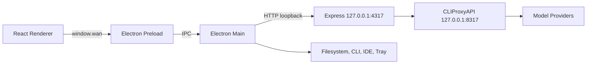
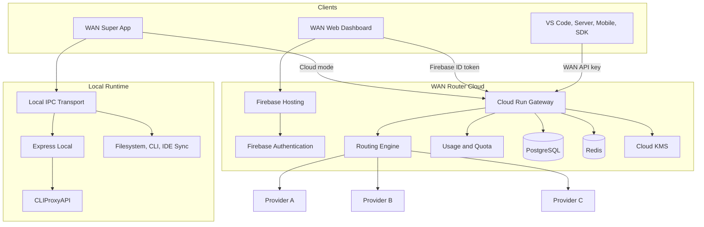
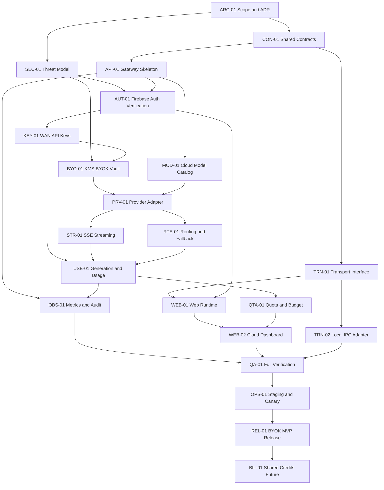

# Handbook: WAN Cliproxy Local + WAN Router Cloud

Panduan arsitektur dan relasi tugas untuk mempertahankan **WAN Cliproxy Local**
di WAN Super App sekaligus menambahkan **WAN Router Cloud** yang dapat digunakan
dari browser dan client API seperti layanan AI gateway.

> Status dokumen: **TARGET DESIGN**. Cliproxy desktop yang ada adalah kondisi
> saat ini. WAN Router Cloud, web dashboard, API key WAN, BYOK cloud, dan billing
> yang dibahas di sini belum dianggap tersedia sampai task dan acceptance gate
> terkait dinyatakan lulus.

Dokumen ini menggunakan empat label:

| Label | Arti |
|-------|------|
| `CURRENT` | Sudah ada di repository atau runtime desktop saat ini |
| `MVP` | Wajib untuk rilis WAN Router Cloud pertama |
| `NEXT` | Dikerjakan setelah MVP stabil |
| `FUTURE` | Belum menjadi komitmen implementasi |

Prinsip "no issue" dalam handbook ini berarti:

- tidak ada deploy publik sebelum security gate dan contract test lulus;
- tidak ada perubahan yang merusak mode local;
- tidak ada credential lokal yang diam-diam dikirim ke cloud;
- task belum `done` jika acceptance criteria atau rollback belum tersedia;
- tidak ada P0/P1 terbuka, vulnerability High/Critical terbuka, atau test wajib
  gagal saat release.

Tidak ada sistem yang dapat dijamin bebas bug. Checklist dan gate di dokumen ini
ditujukan untuk mencegah kelas masalah yang sudah dapat diprediksi.

---

## 1. Keputusan Utama

Target produk adalah satu fitur Cliproxy dengan beberapa mode runtime:

```text
WAN Cliproxy
├── Local
│   ├── CLIProxyAPI berjalan di komputer pengguna
│   ├── OAuth/auth files tetap lokal
│   ├── VS Code, JetBrains, Cowork, terminal, dan filesystem lokal
│   └── dapat digunakan tanpa WAN Router Cloud
│
├── WAN Cloud
│   ├── endpoint OpenAI-compatible melalui HTTPS
│   ├── dapat digunakan dari web, desktop, server, atau mobile
│   ├── Firebase Auth untuk dashboard
│   ├── WAN API key untuk client eksternal
│   ├── provider key resmi pengguna atau BYOK yang terenkripsi
│   └── routing, fallback, usage, quota, dan audit di cloud
│
└── Custom Endpoint
    └── endpoint OpenAI-compatible milik pengguna sendiri
```

Keputusan yang wajib dipertahankan:

1. **Mode Local tidak dihapus dan tidak dipaksa melewati cloud.**
2. **Backend local tidak boleh langsung dipublikasikan ke internet.**
3. **Cloud dibangun sebagai service baru**, bukan dengan membuka Express local
   pada `127.0.0.1:4317`.
4. **MVP dimulai dari BYOK resmi**, bukan penjualan credits bersama.
5. **Renderer memakai transport abstraction** agar halaman yang relevan dapat
   berjalan di Electron maupun browser.
6. **Fitur desktop-only tetap desktop-only.** Web tidak berpura-pura mendukung
   filesystem, terminal, IDE sync, tray, atau instalasi binary.
7. **Prompt dan completion tidak disimpan secara default.** Metadata usage dan
   audit disimpan terpisah.
8. **OAuth/auth files milik Cliproxy Local tidak otomatis di-upload.**
9. **Cloud MVP menggunakan modular monolith**, bukan banyak microservice sejak
   hari pertama. Batas modul tetap jelas agar dapat dipisahkan saat perlu.
10. **Shared credits dan billing adalah fase terpisah** setelah BYOK stabil,
    legal review selesai, dan ledger telah diaudit.

---

## 2. Tujuan dan Bukan Tujuan

### 2.1 Tujuan MVP

- Pengguna dapat login ke web dashboard dengan akun WAN.
- Pengguna dapat membuat dan mencabut WAN API key.
- Pengguna dapat menyimpan provider API key resmi secara terenkripsi.
- Client dapat memanggil `POST /v1/chat/completions` dengan format
  OpenAI-compatible.
- Streaming SSE, cancellation, usage, error normalization, dan basic fallback
  berfungsi.
- WAN Super App dapat memilih Local atau WAN Cloud tanpa mengubah perilaku
  Local yang sudah ada.
- Web dapat memakai halaman Chat, Models, Usage, Providers, Combos/Policies,
  dan Quota/Budget yang memang relevan untuk cloud.
- Setiap request terisolasi per user/workspace dan memiliki `request_id`.
- Ada staging, monitoring, rate limit, audit event, dan rollback.

### 2.2 Bukan Tujuan MVP

- Menjalankan Cowork atau terminal komputer dari browser.
- Menyalin auth files/OAuth subscription lokal ke cloud.
- Menjalankan binary CLIProxyAPI desktop di Firebase Hosting atau Functions.
- Menjual credits inference kepada publik.
- Menyediakan ratusan provider sekaligus.
- Auto-router berbasis machine learning.
- Meniru branding, UI, atau implementasi internal OpenRouter.
- Menjalankan arbitrary tool dari model di server cloud.

---

## 3. Kondisi Saat Ini (`CURRENT`)

Arsitektur Cliproxy desktop saat ini:



Titik pemilik perilaku saat ini:

| Lokasi | Tanggung jawab |
|--------|----------------|
| `renderer/api/client.ts` | Request dashboard melalui `window.wan.request` |
| `preload/index.cjs` | Bridge aman renderer ke named IPC channels |
| `main/ipc.ts` | Request local dan aksi desktop-only |
| `main/index.ts` | Boot backend local dan lifecycle Electron |
| `main/config.ts` | Port dan home directory local |
| `main/backend/index.js` | Express local, CORS local, route mounting |
| `main/backend/routes.js` | Server, model, provider, usage, config, proxy routes |
| `main/backend/cliproxy-manager.js` | Binary, config file, child process |

Backend local sengaja mempercayai loopback dan tidak memiliki autentikasi
multi-user. Endpoint tersebut dapat mengelola API key, auth files, config, dan
binary. Karena itu:

> **DILARANG:** bind backend local ke `0.0.0.0`, memasangnya di reverse proxy,
> atau membuka port `4317`/`8317` ke internet.

Cloud harus mempunyai autentikasi, otorisasi, tenant isolation, encrypted
secret storage, rate limit, audit, dan kontrak API tersendiri.

---

## 4. Arsitektur Target



### 4.1 Control Plane dan Data Plane

Pisahkan dua jenis pekerjaan walaupun MVP masih satu Cloud Run service:

| Plane | Fungsi | Auth |
|-------|--------|------|
| Control plane | Profile, provider key, WAN API key, policy, budget, usage UI | Firebase ID token |
| Data plane | `/v1/models`, `/v1/chat/completions`, streaming | WAN API key atau first-party session |

Alasan pemisahan:

- data plane harus ringan, streaming-friendly, dan tidak bergantung pada UI;
- control plane boleh mempunyai operasi CRUD dan validasi tambahan;
- rate limit, scope, logging, serta permission keduanya berbeda;
- pemisahan service di masa depan tidak memerlukan perubahan kontrak client.

### 4.2 Sumber Kebenaran

| Data | Local | Cloud |
|------|-------|-------|
| OAuth/auth files | File lokal CLIProxyAPI | Tidak disalin |
| Provider API key | Config/auth lokal | Ciphertext terenkripsi KMS |
| Model live | CLIProxyAPI `/v1/models` | Catalog dan endpoint cloud |
| Usage | Usage store lokal | Generation dan usage ledger cloud |
| Conversation | File userData lokal | Pilihan produk; metadata/cloud sync terpisah |
| Routing | Config/model combo lokal | Routing policy per workspace |
| Budget | Local state | Budget per API key/workspace |

UI harus menunjukkan asal data, misalnya `LOCAL` atau `WAN CLOUD`. Jangan
menggabungkan dua sumber diam-diam karena pengguna dapat salah memahami akun,
quota, atau biaya yang sedang digunakan.

---

## 5. Mode Runtime dan Feature Matrix

| Fitur | Desktop Local | Desktop Cloud | Web Cloud |
|-------|---------------|---------------|-----------|
| Chat | Ya | Ya | Ya |
| Model catalog | Local models | Cloud models | Cloud models |
| Usage | Local usage | Cloud usage | Cloud usage |
| Provider management | Local auth/config | Cloud BYOK | Cloud BYOK |
| Model combo/routing policy | Local combo | Cloud policy | Cloud policy |
| Quota/budget | Local | Cloud | Cloud |
| Install/start/stop binary | Ya | Tidak relevan | Tidak |
| VS Code sync | Ya | Opsional memilih cloud base URL | Tidak |
| JetBrains sync | Ya | Opsional memilih cloud base URL | Tidak |
| CLI tools config | Ya | Opsional dari desktop | Tidak |
| Cowork filesystem | Ya | Model cloud, tool tetap lokal | Tidak |
| Terminal/run command | Ya, approval-gated | Ya di desktop, approval-gated | Tidak |
| Tray/global shortcut | Ya | Ya | Tidak |
| API untuk client eksternal | Loopback saja | HTTPS publik | HTTPS publik |

Aturan capability UI:

- Web **menyembunyikan** aksi desktop-only; jangan hanya menampilkan tombol yang
  selalu error.
- Desktop Cloud masih boleh menggunakan kemampuan desktop seperti Cowork, tetapi
  hanya model call yang menuju cloud. Eksekusi tool tetap terjadi di Electron
  main dan tetap membutuhkan approval.
- Perpindahan Local -> Cloud harus eksplisit. Jangan melakukan cloud fallback
  tanpa persetujuan karena prompt dapat meninggalkan perangkat.

---

## 6. Batas Tanggung Jawab Komponen

### 6.1 Shared Renderer

Boleh menangani:

- komponen UI dan state presentasi;
- pemilihan mode;
- request melalui interface transport;
- parsing response yang sudah dinormalisasi;
- capability-based navigation.

Tidak boleh menangani:

- provider secret;
- verifikasi API key;
- akses filesystem Node;
- pemilihan tenant hanya dari nilai client;
- perhitungan billing final.

### 6.2 Electron Main

Tetap menangani:

- Local Cliproxy lifecycle;
- IPC dan context bridge;
- file picker, filesystem, terminal, Cowork approval;
- VS Code/JetBrains sync;
- penyimpanan lokal;
- login WAN pada desktop melalui bridge yang dibatasi.

Electron main tidak menjadi cloud server publik.

### 6.3 WAN Router Gateway

Menangani:

- autentikasi dan tenant resolution;
- request validation;
- model/provider routing;
- decrypt secret hanya ketika request membutuhkannya;
- streaming dan cancellation;
- usage, quota, audit, dan normalized error;
- circuit breaker dan provider health.

Gateway tidak boleh:

- menjalankan arbitrary shell command;
- mengakses filesystem pengguna;
- menerima path lokal dari web untuk dibaca;
- memakai auth file subscription yang diambil dari desktop;
- mencatat prompt/completion secara default.

### 6.4 Firebase

Digunakan untuk:

- Hosting web dashboard;
- Firebase Authentication;
- profile/preference non-rahasia bila diperlukan;
- integrasi akun WAN yang konsisten dengan modul lain.

Tidak digunakan untuk menyimpan plaintext:

- WAN API key secret;
- provider API key;
- OAuth refresh token;
- payment secret;
- KMS key material.

Data sensitif dan ledger tidak boleh dapat dibaca langsung melalui Firebase
client SDK. Semua operasi melewati server.

---

## 7. Struktur Repository Target

Struktur berikut adalah target, bukan kondisi repository saat ini:

```text
modules/cliproxy/
├── renderer/
│   ├── api/
│   ├── transport/
│   │   ├── types.ts
│   │   ├── local-ipc.ts
│   │   ├── cloud-http.ts
│   │   └── runtime.ts
│   └── capabilities.ts
├── shared/
│   ├── api-types.ts
│   ├── errors.ts
│   ├── models.ts
│   └── validation.ts
└── web/
    ├── index.html
    ├── main.tsx
    └── auth.ts

services/wan-router/
├── src/
│   ├── app.ts
│   ├── auth/
│   ├── control/
│   ├── inference/
│   ├── providers/
│   ├── routing/
│   ├── usage/
│   ├── security/
│   └── observability/
├── migrations/
├── test/
├── package.json
└── tsconfig.json

firebase/hosting/cliproxy/
└── web build output
```

Aturan ownership:

- `modules/cliproxy/main/backend/*` tetap backend local.
- Cloud code tidak diimpor dari Electron main saat runtime.
- Shared package hanya berisi type, schema, dan pure function yang aman untuk
  browser maupun server.
- Jangan memindahkan secret logic ke shared package.

---

## 8. Transport Abstraction

Perubahan pertama harus kecil dan tidak mengubah perilaku desktop.

Target interface:

```ts
export type RuntimeKind = "desktop-local" | "desktop-cloud" | "web-cloud";

export interface TransportResponse {
  ok: boolean;
  status: number;
  statusText: string;
  text: string;
  requestId?: string;
}

export interface CliproxyTransport {
  readonly kind: RuntimeKind;
  request(input: {
    method: string;
    path: string;
    body?: string;
    contentType?: string;
    signal?: AbortSignal;
  }): Promise<TransportResponse>;
}
```

Implementasi:

```text
LocalIpcTransport
  -> window.wan.request
  -> Electron IPC
  -> local backend /api/*

CloudHttpTransport
  -> fetch HTTPS
  -> Firebase ID token atau WAN API key
  -> cloud control/data API
```

Streaming chat menggunakan interface terpisah karena response berbentuk stream:

```ts
export interface ChatStreamHandle {
  abort(): void;
  done: Promise<void>;
}

export interface ChatTransport {
  startChat(
    request: NormalizedChatRequest,
    listener: (event: NormalizedChatEvent) => void,
  ): ChatStreamHandle;
}
```

Aturan implementasi:

1. `LocalIpcTransport` harus menjadi wrapper tipis dari perilaku sekarang.
2. Semua test halaman desktop yang ada harus tetap lulus setelah abstraction.
3. `CloudHttpTransport` tidak boleh mengakses `window.wan`.
4. Browser POST streaming memakai `fetch` + `ReadableStream`, bukan
   `EventSource`, karena `EventSource` tidak mendukung POST body.
5. Desktop-only service tetap berada di namespace terpisah, misalnya
   `desktopServices`, bukan dipalsukan sebagai cloud transport.
6. Mode dan base URL tidak boleh berasal dari query string tanpa validasi.

### 8.1 Runtime Capabilities

```ts
export interface RuntimeCapabilities {
  serverLifecycle: boolean;
  localAuthFiles: boolean;
  ideSync: boolean;
  cliToolConfig: boolean;
  coworkFilesystem: boolean;
  terminal: boolean;
  cloudApiKeys: boolean;
  cloudProviderKeys: boolean;
  cloudUsage: boolean;
}
```

Navigation dan tombol ditentukan oleh capability, bukan deteksi acak seperti
`if (window.wan)` yang tersebar di setiap halaman.

---

## 9. Kontrak API Cloud

### 9.1 Base URL

Gunakan domain terpisah:

```text
https://api.<wan-domain>/v1
```

Jangan gunakan port local atau route management desktop sebagai API publik.

### 9.2 Autentikasi

Public inference API:

```http
Authorization: Bearer wan_sk_live_<key-id>_<secret>
```

First-party web dashboard:

```http
Authorization: Bearer <Firebase-ID-token>
```

Aturan:

- Firebase token hanya untuk first-party control plane dan web chat.
- WAN API key digunakan client eksternal.
- Browser tidak menyimpan long-lived WAN API key di `localStorage`.
- Management/admin credential harus mempunyai audience dan scope berbeda.
- CORS bukan mekanisme autentikasi.

### 9.3 Endpoint MVP

Data plane:

```text
GET  /v1/models
POST /v1/chat/completions
GET  /v1/generations/:id
```

Control plane:

```text
GET    /api/me
GET    /api/keys
POST   /api/keys
DELETE /api/keys/:id

GET    /api/provider-credentials
POST   /api/provider-credentials
PATCH  /api/provider-credentials/:id
DELETE /api/provider-credentials/:id
POST   /api/provider-credentials/:id/verify

GET    /api/routing-policies
POST   /api/routing-policies
PATCH  /api/routing-policies/:id
DELETE /api/routing-policies/:id

GET    /api/usage
GET    /api/generations
GET    /api/budgets
PUT    /api/budgets/:id
```

### 9.4 `GET /v1/models`

Minimum response:

```json
{
  "object": "list",
  "data": [
    {
      "id": "anthropic/claude-example",
      "object": "model",
      "created": 0,
      "owned_by": "anthropic"
    }
  ]
}
```

Metadata harga, capability, privacy, dan endpoint detail dapat berada di
control endpoint tersendiri agar format OpenAI-compatible tetap sederhana.

Konvensi model ID:

```text
<provider>/<model>
wan/combo/<slug>       NEXT
wan/auto               FUTURE
```

Local model ID yang sudah ada tidak perlu diubah. UI memakai adapter untuk
menampilkan ID sesuai runtime.

### 9.5 `POST /v1/chat/completions`

MVP wajib mendukung:

- `model`;
- `messages` dengan role `system`, `user`, `assistant`, dan `tool`;
- `stream`;
- `max_tokens` atau equivalent yang dinormalisasi;
- `temperature` bila provider mendukung;
- `tools` dan `tool_choice` bila model/provider mendukung;
- `response_format` hanya bila capability menyatakan tersedia;
- `user` sebagai stable abuse-tracking identifier opsional;
- `metadata` yang dibatasi ukuran dan key-nya.

Parameter tidak didukung harus:

- ditolak dengan `400 unsupported_parameter`; atau
- dihapus hanya jika policy kompatibilitas secara eksplisit mengizinkan dan
  response metadata memberi tahu client.

Jangan diam-diam mengabaikan parameter penting.

### 9.6 Streaming SSE

Format:

```text
data: {"id":"gen_...","object":"chat.completion.chunk","choices":[...]}

data: {"id":"gen_...","choices":[],"usage":{...}}

data: [DONE]

```

Aturan:

- kirim header SSE sebelum token pertama;
- jangan buffer seluruh completion;
- propagasikan client disconnect ke upstream `AbortController`;
- heartbeat boleh berupa SSE comment;
- usage final dikirim sekali jika tersedia;
- setelah token pertama terkirim, jangan restart transparan ke provider lain
  karena dapat menggandakan output dan biaya;
- jika stream gagal setelah token pertama, kirim normalized stream error dan
  tutup stream;
- fallback hanya aman sebelum response body mulai dikirim.

### 9.7 Error Normalization

```json
{
  "error": {
    "message": "Readable message",
    "type": "rate_limit_error",
    "code": "provider_rate_limited",
    "request_id": "req_..."
  }
}
```

Minimum mapping:

| HTTP | Arti |
|------|------|
| 400 | Request/parameter invalid |
| 401 | WAN API key invalid/revoked |
| 402 | Credit tidak cukup, hanya fase billing |
| 403 | Scope, policy, atau model tidak diizinkan |
| 404 | Model/resource tidak ditemukan |
| 409 | Conflict atau credential state berubah |
| 413 | Payload terlalu besar |
| 429 | Rate, concurrency, quota, atau budget limit |
| 499 | Client membatalkan, untuk log internal |
| 502 | Semua provider attempt gagal |
| 503 | Router tidak mempunyai endpoint sehat |
| 504 | Upstream timeout |

Raw provider error tidak boleh dikirim jika mengandung secret, internal URL,
atau detail tenant lain.

### 9.8 Idempotency dan Retry

- Terima `Idempotency-Key` untuk non-streaming request.
- Key di-scope ke tenant + endpoint + body hash.
- Streaming request tidak di-replay otomatis setelah token pertama.
- Gateway mencatat setiap provider attempt agar kemungkinan duplicate upstream
  cost dapat direkonsiliasi.
- Retry hanya untuk error yang dinilai transient: network, timeout tertentu,
  `429`, dan `5xx` sesuai policy.
- Jangan fallback untuk invalid request, content policy, atau auth failure yang
  jelas berlaku terhadap request/user.

---

## 10. Provider Adapter dan Routing

### 10.1 Provider Adapter

Semua provider diubah ke kontrak internal yang sama:

```ts
export interface ProviderAdapter {
  readonly id: string;
  listModels(context: ProviderContext): Promise<ProviderModel[]>;
  chat(
    request: NormalizedChatRequest,
    context: ProviderContext,
  ): AsyncIterable<NormalizedChatEvent>;
  normalizeError(error: unknown): NormalizedProviderError;
}
```

MVP sebaiknya mulai dengan dua jenis adapter:

1. `OpenAICompatibleAdapter` untuk endpoint resmi yang kompatibel.
2. Satu adapter native untuk provider yang formatnya berbeda dan benar-benar
   dibutuhkan.

Aturan adapter:

- memakai API resmi dan mematuhi Terms of Service provider;
- tidak menulis credential ke log;
- meneruskan cancellation;
- menghormati timeout;
- mengubah usage ke unit internal;
- mempunyai fixture test streaming yang terfragmentasi;
- menyatakan capability, bukan menebak dari nama model saja.

### 10.2 Candidate Selection

Urutan router:

```text
Resolve tenant and API key
  -> validate model and request capability
  -> load routing policy
  -> collect eligible provider endpoints
  -> apply credential and privacy filters
  -> apply budget and max-price filter
  -> remove open circuit endpoints
  -> sort by configured strategy
  -> execute primary
  -> fallback only when policy permits
  -> record attempts and final usage
```

### 10.3 Strategi MVP

MVP mendukung:

- fixed provider order;
- `allow_fallbacks`;
- health-aware skip;
- per-model credential filter;
- per-API-key policy;
- basic `price`, `latency`, atau `priority` sort jika datanya tersedia;
- sticky provider per `session_id` dengan TTL terbatas.

Belum perlu pada MVP:

- classifier prompt;
- marketplace provider;
- benchmark-based quality router;
- dynamic shared capacity;
- complex optimizer lintas model.

### 10.4 Fallback Rules

| Kondisi | Fallback? |
|---------|-----------|
| DNS/network failure sebelum response | Ya |
| Connect/read timeout sebelum token pertama | Ya |
| Provider `429` | Ya, jika endpoint lain diizinkan |
| Provider `5xx` | Ya |
| Invalid API key milik satu BYOK credential | Ya ke credential berikutnya; tandai unhealthy |
| Request `400` | Tidak, kecuali adapter membuktikan provider-specific mismatch |
| Content policy rejection | Tidak secara default |
| Stream gagal setelah token pertama | Tidak otomatis |
| User cancel | Tidak |
| Budget atau policy WAN menolak | Tidak |

### 10.5 Circuit Breaker

Per endpoint simpan:

- rolling success/failure count;
- consecutive failures;
- last success/failure;
- `open_until`;
- latency dan time-to-first-token;
- `429` rate terpisah dari `5xx`.

Circuit breaker tidak boleh global per provider jika provider memiliki beberapa
region atau credential independen.

---

## 11. Authentication, API Key, dan Secret

### 11.1 Firebase Identity

- Firebase UID menjadi external identity, bukan primary database secret.
- Server memverifikasi signature, issuer, audience, expiry, dan revoked user
  policy bila diperlukan.
- `user_id` internal dipetakan dari Firebase UID.
- Tenant/workspace selalu diselesaikan server-side.
- Claim admin tidak boleh ditentukan oleh request body.

Satu akun WAN dapat digunakan lintas modul, tetapi data Router Cloud harus
mempunyai collection/table, service account, dan authorization rule sendiri.

### 11.2 WAN API Key

Format rekomendasi:

```text
wan_sk_<environment>_<key-id>_<random-secret>
```

Database hanya menyimpan:

- key ID dan prefix untuk lookup/display;
- digest/HMAC secret menggunakan pepper di Secret Manager/KMS;
- owner/workspace;
- scopes;
- rate and budget policy;
- status, created, expires, last used;
- optional IP/origin restriction.

Plaintext key:

- ditampilkan satu kali setelah create;
- tidak dapat dibaca ulang;
- tidak masuk log, analytics, error, atau support ticket;
- dapat dirotasi dengan overlap period;
- dapat dicabut segera.

Scope minimum:

```text
models:read
chat:write
usage:read
keys:manage        control plane only
providers:manage   control plane only
```

### 11.3 Provider BYOK

Provider key disimpan dengan envelope encryption:

```text
Provider secret
  -> encrypt with per-record data encryption key
  -> wrap data key with Cloud KMS
  -> store ciphertext + wrapped key + KMS version
```

Minimum metadata:

- provider;
- user/workspace owner;
- encrypted payload;
- key version;
- masked display value;
- priority and fallback role;
- model filters;
- status and last verification;
- created/rotated/revoked timestamps.

Aturan:

- decrypt hanya pada request yang membutuhkan credential tersebut;
- plaintext hidup sesingkat mungkin di memory;
- jangan cache plaintext di Redis;
- verification endpoint melakukan request minimum yang murah dan dibatasi;
- invalid key tidak dikembalikan ke browser;
- delete menghapus ciphertext dan invalidates cache;
- KMS rotation mempunyai migration/runbook;
- support/admin tidak dapat membaca secret.

### 11.4 Credential yang Dilarang Di-upload

- auth files CLIProxyAPI local;
- browser cookies provider;
- OAuth refresh token subscription yang tidak mempunyai izin cloud relay;
- service-account file dari komputer pengguna tanpa flow BYOK yang eksplisit;
- credential hasil scraping atau spoofing client identity.

MVP menerima API key atau service credential resmi yang memang diizinkan oleh
provider untuk server-side inference.

---

## 12. Model Data Cloud

PostgreSQL direkomendasikan untuk API key, tenant isolation, generation,
attempt, usage, budget, dan ledger. Firestore dapat tetap dipakai untuk profile
atau preference non-kritis.

### 12.1 Entitas Inti

| Entitas | Field penting |
|---------|---------------|
| `users` | id, firebase_uid, status, created_at |
| `workspaces` | id, owner_id, name, status |
| `workspace_members` | workspace_id, user_id, role |
| `api_keys` | id, workspace_id, prefix, digest, scopes, status, last_used_at |
| `provider_credentials` | id, workspace_id, provider, ciphertext, kms_version, filters, status |
| `models` | canonical_id, provider, capabilities, context, status |
| `provider_endpoints` | id, model_id, provider, region, price, health, policy |
| `routing_policies` | id, workspace_id, name, strategy, fallback, filters |
| `generations` | id, workspace_id, api_key_id, model, status, usage, cost, timestamps |
| `provider_attempts` | generation_id, endpoint_id, status, latency, usage, error_code |
| `usage_ledger` | workspace_id, generation_id, dimension, quantity, amount |
| `budgets` | workspace_id/api_key_id, period, limit, action |
| `audit_events` | actor, workspace, action, resource, request_id, timestamp |
| `credit_ledger` | FUTURE append-only debit/credit entries |

### 12.2 Tenant Isolation

Setiap row tenant-owned wajib memiliki `workspace_id` atau owner yang setara.

Rules:

- client tidak boleh memilih workspace yang tidak berasal dari auth context;
- semua repository query menerima server-resolved tenant context;
- cache key selalu memasukkan workspace ID;
- object storage path selalu memasukkan non-guessable tenant ID;
- integration test wajib mencoba cross-tenant read/write;
- background job membawa explicit tenant context;
- admin support access selalu diaudit dan time-bound.

PostgreSQL Row Level Security dapat digunakan sebagai defense-in-depth setelah
connection context dan pooling diuji. Application authorization tetap wajib.

### 12.3 Generation Record

Generation menyimpan metadata minimum:

```text
generation_id
workspace_id
api_key_id
requested_model
resolved_model
provider_endpoint_id
request_started_at
first_token_at
completed_at
status
prompt_tokens
completion_tokens
reasoning_tokens
cached_tokens
upstream_cost
charged_cost (FUTURE)
request_id
```

Prompt dan completion tidak menjadi field default.

### 12.4 Nilai Uang

- Jangan gunakan floating point JavaScript untuk ledger.
- Simpan decimal fixed precision atau integer unit terkecil.
- Simpan price snapshot pada generation/attempt.
- Perubahan harga model tidak boleh mengubah histori lama.
- Currency wajib eksplisit.

---

## 13. Usage, Quota, dan Budget

### 13.1 Alur Usage

```text
Request accepted
  -> create generation pending
  -> create provider attempt
  -> stream response
  -> receive/derive usage
  -> finalize attempt
  -> finalize generation
  -> append usage ledger
  -> update counters asynchronously
```

Provider-reported usage adalah sumber utama. Jika provider tidak memberi usage:

- estimasi boleh dipakai untuk dashboard sementara;
- tandai `estimated: true`;
- jangan menagih shared credits berdasarkan estimasi tanpa reconciliation
  policy yang disetujui;
- simpan tokenizer/version yang dipakai untuk estimasi.

### 13.2 Limit Layer

Terapkan berlapis:

1. payload size;
2. request per minute;
3. token/request maximum;
4. concurrent streams;
5. daily/monthly token quota;
6. spend budget;
7. provider-specific capacity;
8. abuse and anomaly controls.

Response `429` harus membedakan:

```text
rate_limit_exceeded
concurrency_limit_exceeded
token_quota_exceeded
budget_exceeded
provider_rate_limited
```

### 13.3 Budget Action

Budget mempunyai action:

- `notify`;
- `throttle`;
- `block`;
- `fallback_to_cheaper_policy` (`NEXT`, harus eksplisit).

Budget check harus atomic terhadap request admission. Counter dashboard yang
eventually consistent tidak boleh menjadi satu-satunya pengaman biaya.

---

## 14. Billing dan Credits

### 14.1 MVP: BYOK Only

Pada MVP:

- provider menagih langsung akun provider pengguna;
- WAN mencatat usage dan estimated cost untuk visibility;
- WAN belum menjual inference credits;
- tidak ada saldo yang dapat menjadi negatif;
- tidak ada klaim harga pass-through sebelum kontrak bisnis disetujui.

Ini mengurangi risiko finansial dan memungkinkan fokus pada routing, keamanan,
dan pengalaman pengguna.

### 14.2 Shared Credits (`FUTURE`)

Shared credits baru boleh dimulai setelah:

- kontrak provider dan hak resale/aggregation jelas;
- Terms, Privacy, refund, tax, dan payment review selesai;
- append-only credit ledger diaudit;
- pre-authorization/reservation tersedia;
- reconciliation provider tersedia;
- webhook payment idempotent;
- fraud, chargeback, abuse, dan account suspension runbook tersedia;
- kill switch per provider dan per workspace tersedia.

Alur yang disarankan:

```text
Check balance and budget
  -> reserve maximum expected amount
  -> run generation
  -> calculate actual amount
  -> settle actual debit
  -> release unused reservation
  -> reconcile with upstream invoice
```

Jangan mengurangi saldo hanya dari counter UI atau log agregat.

---

## 15. Privacy dan Data Handling

Default policy:

- log metadata: request ID, time, model, provider, token, latency, status;
- tidak log prompt/completion;
- tidak log Authorization header;
- tidak log provider request body mentah;
- error body disanitasi;
- opt-in content logging harus terpisah, jelas, time-limited, dan dapat dihapus;
- provider privacy capability dapat menjadi routing filter;
- account deletion menghapus credential dan menjadwalkan deletion data sesuai
  retention policy;
- audit security dapat mempunyai retention berbeda dari usage.

Pengguna harus mengetahui saat berpindah:

```text
LOCAL     prompt diproses melalui runtime lokal dan provider terpilih
WAN CLOUD prompt melewati WAN Router Cloud dan provider terpilih
```

Cloud fallback dari Local tidak boleh otomatis aktif.

---

## 16. Security Requirements

### 16.1 Threat dan Control

| Threat | Control wajib |
|--------|---------------|
| WAN API key dicuri | One-time display, hash/HMAC, scopes, rotation, revoke, anomaly detection |
| Provider key bocor | KMS envelope encryption, redaction, least privilege, short plaintext lifetime |
| Cross-tenant access | Server-resolved tenant, scoped query/cache, negative integration tests |
| SSRF custom endpoint | HTTPS allow policy, deny private/link-local/metadata IP, DNS re-check, redirect validation |
| Cost explosion | Atomic quota, concurrency limit, budget block, provider kill switch |
| Prompt bocor ke log | Structured allowlist logging, body/header redaction, log scanner |
| Replay/double charge | Idempotency, attempt ledger, no stream replay after first token |
| Provider outage | Circuit breaker, health-aware fallback, timeout, alert |
| Malicious model tool | Cloud does not execute arbitrary tools; desktop approval remains mandatory |
| Admin abuse | Role separation, audited access, no secret read endpoint |
| Supply-chain issue | Lockfile, dependency audit, signed build/deploy provenance |

### 16.2 SSRF Guard

Jika custom OpenAI-compatible endpoint ditambahkan:

- hanya `https://` untuk production;
- reject localhost, RFC1918, link-local, multicast, metadata service, dan Unix
  socket tricks;
- resolve DNS lalu validasi semua IP;
- validasi ulang setiap redirect;
- batasi redirect count;
- batasi response size dan timeout;
- jangan meneruskan WAN credential ke host custom;
- simpan custom provider secret terpisah;
- egress allowlist lebih baik untuk provider resmi.

Custom endpoint sebaiknya `NEXT`, bukan bagian MVP pertama.

### 16.3 Browser Security

- CSP hanya mengizinkan asset dan API domain yang diperlukan;
- tidak ada provider key dalam bundle;
- Firebase web config boleh publik, secret tidak;
- hindari token di URL;
- gunakan secure browser storage yang sesuai untuk Firebase session;
- protection terhadap XSS lebih penting daripada menyimpan token dengan
  obfuscation;
- dependency dan HTML sanitization wajib diuji;
- CORS allowlist untuk web control plane;
- public inference API tetap memerlukan Bearer key walaupun CORS menolak browser.

### 16.4 Desktop Security

- preload tetap expose named methods saja;
- renderer tidak menerima raw `ipcRenderer`;
- cloud token tidak dikirim melalui URL;
- sensitive desktop session memakai `safeStorage` bila tersedia;
- logout menghapus token/cache cloud;
- Local mode tetap berfungsi saat user tidak login cloud.

---

## 17. Deployment Target

### 17.1 Environment

Minimal tiga environment terpisah:

| Environment | Fungsi |
|-------------|--------|
| `dev` | Local development, mock provider, Firebase emulator |
| `staging` | Real cloud integration, synthetic data, canary test |
| `prod` | User production |

Jangan memakai production provider key atau production database pada automated
test.

### 17.2 Komponen GCP/Firebase

| Komponen | Pilihan |
|----------|---------|
| Web | Firebase Hosting |
| Identity | Firebase Authentication |
| Gateway | Cloud Run |
| Relational data | Cloud SQL PostgreSQL |
| Rate/cache | Memorystore Redis |
| Encryption | Cloud KMS |
| Runtime secrets | Secret Manager |
| Metrics/logs | Cloud Monitoring/Logging |
| Edge protection | HTTPS Load Balancer + Cloud Armor bila production publik |

Firebase Functions tetap cocok untuk task control-plane pendek atau event, tetapi
data plane streaming utama ditempatkan di Cloud Run.

### 17.3 Cloud Run Rules

- app-layer auth wajib karena OpenAI-compatible client tidak membawa Google IAM
  token;
- request timeout harus cukup untuk streaming tetapi tetap memiliki hard limit;
- cancellation diteruskan ke provider;
- concurrency ditentukan melalui load test;
- minimum instances production dipertimbangkan untuk mengurangi cold start;
- database pool dibatasi berdasarkan total instance x pool size;
- graceful shutdown menghentikan admission request baru;
- health endpoint tidak melakukan provider inference berbayar;
- migration dijalankan sebagai job terpisah, bukan oleh semua instance startup.

### 17.4 Configuration

Environment variable hanya menyimpan identifier/config non-secret. Secret value
diambil dari Secret Manager/KMS.

Contoh target:

```text
WAN_ENV=staging
WAN_PUBLIC_API_ORIGIN=https://api-staging.<wan-domain>
WAN_FIREBASE_PROJECT_ID=...
WAN_DATABASE_URL=<Secret Manager reference>
WAN_REDIS_URL=<Secret Manager reference>
WAN_KMS_KEY=projects/.../cryptoKeys/...
WAN_PROMPT_LOGGING=false
```

---

## 18. Relasi Tugas dan Ownership

Ownership di bawah adalah domain kerja, bukan nama orang:

| Owner | Area |
|-------|------|
| ARCH | Architecture, ADR, contract, scope |
| DESKTOP | Electron, preload, IPC, Local compatibility |
| FRONTEND | Shared renderer, web shell, auth UI |
| CLOUD | Gateway, provider adapter, routing |
| DATA | PostgreSQL, usage, quota, ledger |
| SECURITY | Threat model, API key, KMS, review |
| QA | Contract, integration, E2E, load, security tests |
| OPS | CI/CD, environment, monitoring, incident response |

### 18.1 Dependency Graph



### 18.2 Task Register

| ID | Owner | Depends | Deliverable | Acceptance criteria |
|----|-------|---------|-------------|---------------------|
| ARC-01 | ARCH | - | ADR Local + Cloud, scope, naming | Keputusan 1-10 disetujui; CURRENT/MVP/NEXT jelas |
| CON-01 | ARCH/CLOUD | ARC-01 | Shared request, response, error, stream schema | Schema test dan backward compatibility fixture lulus |
| SEC-01 | SECURITY | ARC-01 | Threat model dan data classification | Semua secret/data memiliki owner, storage, retention, dan control |
| TRN-01 | FRONTEND | CON-01 | `CliproxyTransport` dan capability model | Tidak ada page baru yang langsung bergantung pada runtime global |
| TRN-02 | DESKTOP | TRN-01 | Local IPC adapter | Desktop behavior dan existing routes tetap identik |
| API-01 | CLOUD | CON-01 | Cloud Run modular-monolith skeleton | Health, request ID, validation, graceful shutdown lulus |
| AUT-01 | CLOUD/SECURITY | API-01, SEC-01 | Firebase ID token verification | Expired, wrong audience, disabled user, cross-tenant test ditolak |
| KEY-01 | CLOUD/SECURITY | AUT-01 | WAN API key create/list/revoke/verify | Plaintext one-time; DB tanpa plaintext; scope dan revoke langsung efektif |
| BYO-01 | CLOUD/SECURITY | KEY-01, SEC-01 | KMS-encrypted provider credential | Ciphertext at rest; log redaction; rotation/delete test lulus |
| MOD-01 | CLOUD | API-01 | Canonical cloud model catalog | Stable ID, capability, status, owner, filter test lulus |
| PRV-01 | CLOUD | MOD-01, BYO-01 | Provider adapter pertama | Stream/non-stream, usage, timeout, cancellation, error fixture lulus |
| STR-01 | CLOUD | PRV-01 | OpenAI-compatible SSE | Fragmentation, `[DONE]`, usage final, abort, slow-client test lulus |
| RTE-01 | CLOUD | PRV-01 | Fixed routing, fallback, circuit breaker | Fallback matrix dan no-retry-after-first-token lulus |
| USE-01 | DATA | KEY-01, STR-01, RTE-01 | Generation, attempt, usage records | No lost final state; duplicate/retry reconciliation test lulus |
| QTA-01 | DATA/CLOUD | USE-01 | Atomic rate, concurrency, quota, budget | Parallel admission test tidak melewati hard limit |
| WEB-01 | FRONTEND | TRN-01, AUT-01 | Browser runtime + Firebase login | Desktop global tidak dibutuhkan; refresh/session/logout E2E lulus |
| WEB-02 | FRONTEND | WEB-01, QTA-01 | Chat, Models, Providers, Usage, Keys, Policies | Capability matrix dan responsive E2E lulus |
| OBS-01 | OPS/CLOUD | API-01, USE-01 | Metrics, structured logs, audit, alerts | Secret/prompt redaction scan lulus; dashboard dan alert aktif |
| QA-01 | QA/SECURITY | Semua MVP | Contract, security, tenant, E2E, load test suite | Semua release gate hijau; tidak ada P0/P1/High/Critical terbuka |
| OPS-01 | OPS | QA-01 | Staging, migration, canary, rollback | Deploy dan rollback rehearsal berhasil |
| REL-01 | Semua | OPS-01 | BYOK MVP release | Canary stabil; runbook on-call; Local regression nol |
| BIL-01 | DATA/LEGAL/SECURITY | REL-01 | Shared credits | Dikerjakan hanya setelah billing gate Section 14.2 |

### 18.3 Aturan Status Task

Task hanya boleh berubah menjadi `done` bila:

1. implementation dan migration selesai;
2. unit/contract/integration test relevan lulus;
3. security/privacy impact diperiksa;
4. observability tersedia;
5. dokumentasi dan runbook diperbarui;
6. rollback atau feature flag tersedia;
7. acceptance criteria pada register terpenuhi.

---

## 19. Urutan Implementasi

### Phase 0 - Foundation

Task:

```text
ARC-01 -> CON-01
ARC-01 -> SEC-01
```

Hasil:

- kontrak dan scope dibekukan;
- data classification selesai;
- tidak ada code cloud publik;
- provider MVP dipilih berdasarkan API resmi dan kebutuhan nyata.

Exit gate:

- tidak ada keputusan kritis yang masih implisit;
- endpoint, model ID, auth mode, dan storage secret telah ditetapkan.

### Phase 1 - Non-breaking Client Split

Task:

```text
TRN-01 -> TRN-02
```

Langkah:

1. Bungkus `window.wan.request` menjadi `LocalIpcTransport`.
2. Pindahkan runtime capability ke satu sumber.
3. Jalankan semua desktop page melalui abstraction baru.
4. Jangan menambahkan network cloud dulu.

Cheap disconfirming check:

- bila halaman Local berubah behavior, transport abstraction salah dan tidak
  boleh dilanjutkan ke web.

Exit gate:

- Local start/stop, Models, Providers, Usage, Chat, Combos, Config, IDE sync,
  dan Cowork tetap berfungsi;
- tidak ada perubahan endpoint local.

### Phase 2 - Cloud API dengan Mock Provider

Task:

```text
API-01 -> AUT-01 -> KEY-01
API-01 -> MOD-01
```

Gunakan deterministic mock provider untuk:

- non-stream response;
- fragmented SSE;
- timeout;
- `429`;
- `5xx`;
- malformed chunk;
- cancellation;
- usage final.

Exit gate:

- public contract dapat diuji tanpa real provider cost;
- API key dan tenant test lulus;
- belum menyimpan provider secret.

### Phase 3 - Secure BYOK dan Provider Pertama

Task:

```text
BYO-01 -> PRV-01 -> STR-01
PRV-01 -> RTE-01
```

Mulai dari provider paling dibutuhkan. Jangan mengintegrasikan banyak provider
sekaligus.

Exit gate:

- encrypted storage dan key rotation lulus;
- request streaming real provider lulus di staging;
- secret tidak muncul di log/error;
- fallback sebelum first token lulus;
- cancellation menghentikan upstream.

### Phase 4 - Usage, Limits, dan Web

Task:

```text
USE-01 -> QTA-01
WEB-01 -> WEB-02
```

Exit gate:

- dashboard tidak membutuhkan `window.wan`;
- API key long-lived tidak disimpan browser;
- usage dan attempts dapat diaudit;
- parallel request tidak menembus budget hard block;
- fitur desktop-only tidak tampil di web.

### Phase 5 - Hardening dan Release

Task:

```text
OBS-01 -> QA-01 -> OPS-01 -> REL-01
```

Exit gate:

- load/chaos/security test lulus;
- alert diuji, bukan hanya dibuat;
- migration backup dan restore diuji;
- canary dan rollback rehearsal berhasil;
- Local mode regression test lulus pada macOS target.

### Phase 6 - Shared Credits (`FUTURE`)

Tidak boleh dimulai hanya karena inference BYOK telah berjalan. Billing memiliki
risiko finansial dan legal berbeda. Ikuti Section 14.2.

---

## 20. Test Strategy

### 20.1 Unit Test

- request/schema validation;
- API key parsing dan digest verification;
- tenant authorization;
- provider parameter mapping;
- error normalization;
- candidate sorting;
- fallback decision;
- circuit breaker state;
- cost/usage arithmetic;
- redaction;
- SSRF URL/IP validation;
- capability matrix.

### 20.2 Contract Test

Satu fixture request diuji terhadap:

- Local adapter yang relevan;
- Cloud mock gateway;
- provider adapter mock;
- streaming parser browser;
- streaming parser desktop.

Contract fixture minimum:

- text completion;
- multi-turn messages;
- tools;
- structured output capability;
- stream split pada setiap kemungkinan byte boundary;
- provider error;
- final usage;
- cancellation.

### 20.3 Integration Test

- Firebase token valid/invalid/expired;
- create/revoke API key;
- encrypted BYOK create/verify/delete;
- database migration;
- Redis rate and concurrency limit;
- provider timeout/fallback;
- generation + provider attempt finalization;
- background reconciliation;
- cross-tenant negative tests;
- audit event creation.

### 20.4 Security Test

- secret scan source, bundle, log, dan error response;
- API key brute-force/rate limit;
- header injection;
- oversized JSON;
- SSRF dan DNS rebinding cases;
- CORS and CSP;
- IDOR/cross-tenant access;
- revoked user/key;
- malicious model/tool payload;
- SQL injection dan unsafe dynamic query;
- dependency vulnerability scan.

### 20.5 E2E

Desktop:

- Local mode tetap berjalan tanpa login WAN;
- Local/Cloud switch eksplisit;
- Cloud chat dari WAN Super App;
- logout membersihkan cloud session;
- Cowork cloud-model call tetap mengeksekusi tool lokal dengan approval;
- IDE sync dapat memilih local atau cloud endpoint tanpa merusak config lama.

Web:

- signup/login/logout/reset session;
- add/verify/delete provider credential;
- create/revoke WAN API key;
- model selection dan chat stream;
- stop generation;
- usage dan budget;
- capability-specific navigation;
- responsive desktop/mobile;
- refresh tidak kehilangan auth state secara salah.

### 20.6 Load dan Chaos

- concurrent streams;
- slow client;
- provider latency spike;
- provider `429` storm;
- Redis unavailable;
- database failover/connection exhaustion;
- Cloud Run scale-out;
- instance termination saat stream;
- duplicate webhook (`FUTURE` billing);
- circuit breaker recovery.

### 20.7 Release Gate

```text
[ ] Unit test pass
[ ] Contract test pass
[ ] Integration test pass
[ ] Cross-tenant negative test pass
[ ] Desktop Local regression pass
[ ] Web E2E pass
[ ] Streaming fragmentation/cancel pass
[ ] Security scan pass
[ ] Load target pass
[ ] Migration forward/backward rehearsal pass
[ ] Rollback rehearsal pass
[ ] No P0/P1 or High/Critical security issue open
```

---

## 21. Observability dan SLO

### 21.1 Structured Log Allowlist

Boleh:

```text
request_id
generation_id
workspace_id hash/internal ID
api_key_id
requested/resolved model
provider endpoint ID
status/error code
latency/TTFT/throughput
token usage
fallback count
estimated/actual flag
```

Tidak boleh:

```text
Authorization header
WAN API key secret
provider key/token
prompt/completion
raw request body
Firebase ID token
database URL
KMS plaintext/decrypted payload
```

### 21.2 Metrics

- request rate;
- success/error per model/provider;
- p50/p90/p99 latency;
- time to first token;
- output tokens/second;
- active streams;
- `429`, timeout, and provider `5xx`;
- fallback count and success;
- circuit state;
- usage/cost by workspace/API key;
- budget rejection;
- DB pool and Redis health;
- key verification failure;
- KMS decrypt failure.

### 21.3 Initial SLO

Contoh target awal yang harus disesuaikan setelah staging load test:

- Gateway availability: 99.9%, tidak menghitung provider-wide outage yang
  transparan diatribusikan terpisah.
- Auth/key verification p95: < 100 ms dari cache path.
- Router overhead p95: < 150 ms, di luar provider latency.
- Usage finalization: 99.9% selesai dalam 5 menit.
- Cross-tenant data exposure: 0 tolerance.
- Secret in logs: 0 tolerance.

### 21.4 Alert

- error rate melewati threshold;
- provider failure spike;
- budget/cost anomaly;
- KMS decrypt failure;
- DB/Redis saturation;
- generation pending terlalu lama;
- tenant authorization denial anomaly;
- secret scanner match;
- audit pipeline berhenti.

Alert wajib memiliki owner, severity, dan runbook link.

---

## 22. Incident Runbook Ringkas

### 22.1 Provider Outage

1. Buka circuit endpoint terdampak.
2. Alihkan ke fallback yang diizinkan.
3. Jangan mengubah privacy/max-price policy pengguna.
4. Tampilkan degraded status.
5. Rekonsiliasi attempt yang statusnya tidak pasti.

### 22.2 WAN/Provider Key Leak

1. Revoke key segera.
2. Invalidasi cache.
3. Rotasi pepper/KMS scope bila blast radius lebih luas.
4. Audit request sejak `last_known_safe`.
5. Beri notifikasi sesuai incident policy.
6. Jangan meminta pengguna mengirim full key ke support.

### 22.3 Suspected Cross-Tenant Access

Severity P0:

1. Hentikan endpoint/feature terkait melalui kill switch.
2. Pertahankan audit evidence.
3. Jangan menjalankan cleanup yang menghapus bukti.
4. Identifikasi affected tenant dan data class.
5. Perbaiki authorization dan tambahkan regression test.
6. Jalankan legal/privacy notification process.

### 22.4 Cost Spike

1. Aktifkan workspace/provider kill switch.
2. Turunkan concurrency/rate limit.
3. Identifikasi key, model, route, dan source.
4. Revoke compromised key bila perlu.
5. Jangan hanya menyembunyikan angka dashboard; hentikan admission secara
   atomic.

### 22.5 Bad Deploy

1. Hentikan traffic canary.
2. Rollback image ke revision sebelumnya.
3. Jangan rollback destructive DB migration tanpa recovery plan.
4. Gunakan backward-compatible migration: expand -> migrate -> contract.
5. Verifikasi Local desktop tidak terdampak.

---

## 23. Release dan Rollback

### 23.1 Feature Flags

Minimum flags:

```text
cloud.enabled
cloud.web.enabled
cloud.provider.<id>.enabled
cloud.routing.fallback.enabled
cloud.customEndpoint.enabled
cloud.sharedCredits.enabled
```

Flags security-critical dievaluasi server-side. Client flag hanya untuk UX.

### 23.2 Canary

Urutan:

```text
internal developers
  -> selected test accounts
  -> small percentage BYOK users
  -> wider BYOK release
  -> NEXT features
```

Canary dipantau berdasarkan error, TTFT, fallback, KMS, database, tenant denial,
dan cost anomaly.

### 23.3 Database Migration

- migration versioned;
- backup sebelum destructive change;
- expand-contract untuk schema compatibility;
- old and new app revision dapat berjalan bersamaan selama rollout;
- migration job idempotent;
- rollback application tidak bergantung pada schema yang sudah dihapus.

### 23.4 Desktop Compatibility

- Cloud feature berada di balik config/feature flag;
- Local mode menjadi default sampai cloud beta dinyatakan stabil;
- update desktop lama tetap dapat menggunakan Local;
- cloud API versioning menjaga client sebelumnya;
- server memberi error upgrade yang jelas jika client terlalu lama, bukan crash.

---

## 24. Jebakan yang Harus Dihindari

1. **Membuka backend local ke internet.** Backend local bukan multi-tenant API.
2. **Memakai CORS sebagai auth.** Non-browser client mengabaikan CORS.
3. **Menyimpan provider key di Firestore client-readable.** Gunakan KMS dan
   server-only access.
4. **Menyimpan WAN API key plaintext.** Tampilkan sekali, lalu simpan digest.
5. **Upload auth files lokal.** Local subscription/OAuth tidak otomatis legal
   atau aman untuk cloud relay.
6. **Fallback setelah stream berjalan.** Dapat menggandakan text dan biaya.
7. **Mencampur Local dan Cloud usage.** Selalu tampilkan source/runtime.
8. **Browser menyimpan API key panjang.** Gunakan Firebase session untuk UI.
9. **Menganggap semua model mendukung semua parameter.** Gunakan capability.
10. **Mengabaikan unsupported parameter diam-diam.** Return error atau metadata.
11. **Menjalankan arbitrary model tools di Cloud Run.** Tool cloud harus
    allowlisted dan sandboxed; MVP tidak menjalankan arbitrary tools.
12. **Menggunakan float untuk billing.** Gunakan decimal/integer unit.
13. **Membuat microservice terlalu awal.** Mulai modular monolith dengan batas
    yang dapat dipisahkan.
14. **Deploy sebelum observability.** Tanpa request/attempt ID, kegagalan routing
    sulit direkonsiliasi.
15. **Menggunakan production secret untuk test.** Gunakan mock atau staging key
    dengan quota rendah.
16. **Custom base URL tanpa SSRF guard.** Jadikan NEXT dan uji secara khusus.
17. **Menggabungkan admin dan inference key.** Scope dan audience harus berbeda.
18. **Mengubah backend verbatim untuk kebutuhan cloud.** Cloud service terpisah
    mencegah vendor sync dan desktop behavior rusak.
19. **Menyalakan Local -> Cloud fallback secara default.** Ini mengubah batas
    privasi tanpa persetujuan.
20. **Memulai billing sebelum ledger.** Dashboard usage bukan financial ledger.

---

## 25. Definition of Done Produk

WAN Router Cloud MVP dianggap selesai hanya bila:

### Product

- [ ] Local Cliproxy tetap berfungsi tanpa akun cloud.
- [ ] Desktop dapat memilih Local atau WAN Cloud secara eksplisit.
- [ ] Web dashboard mempunyai Chat, Models, Providers, API Keys, Usage, Policy,
      dan Budget.
- [ ] Fitur desktop-only tidak muncul di web.
- [ ] External OpenAI-compatible client dapat melakukan stream chat.

### API

- [ ] `/v1/models` stabil.
- [ ] `/v1/chat/completions` stream dan non-stream stabil.
- [ ] Error format dan request ID konsisten.
- [ ] Cancellation menghentikan upstream.
- [ ] Fallback mengikuti matrix dan berhenti setelah first token.

### Security

- [ ] Firebase token diverifikasi penuh.
- [ ] WAN API key tidak disimpan plaintext.
- [ ] BYOK terenkripsi KMS.
- [ ] Cross-tenant test lulus.
- [ ] Secret/prompt log scan lulus.
- [ ] Rate, quota, concurrency, dan hard budget aktif.
- [ ] Tidak ada auth file lokal yang di-upload.

### Data

- [ ] Generation dan provider attempt dapat diaudit.
- [ ] Usage actual/estimated dibedakan.
- [ ] Price snapshot immutable.
- [ ] Migration, backup, dan restore diuji.

### Operations

- [ ] Dev/staging/prod terpisah.
- [ ] Monitoring dashboard aktif.
- [ ] Alert dan incident runbook diuji.
- [ ] Canary dan rollback rehearsal berhasil.
- [ ] Tidak ada P0/P1 atau High/Critical issue terbuka.

---

## 26. Checklist Sebelum Mulai Coding

```text
[ ] Nama produk disepakati: WAN Cliproxy Local + WAN Router Cloud
[ ] MVP BYOK-only disepakati
[ ] Provider resmi pertama dipilih
[ ] Terms provider untuk server-side BYOK diperiksa
[ ] Firebase project/environment strategy disepakati
[ ] Cloud SQL, Redis, KMS, Secret Manager ownership disepakati
[ ] API contract dan model ID convention disetujui
[ ] Prompt logging default OFF disetujui
[ ] Local auth files tidak di-upload disetujui
[ ] Task owner dan acceptance criteria ditetapkan
[ ] Staging budget dan provider quota dibatasi
```

---

## 27. Checklist Implementasi Harian

Sebelum merge:

```text
[ ] Perubahan hanya menyentuh ownership boundary yang relevan
[ ] Tidak ada secret/test token di diff
[ ] Unit/contract test slice terkait lulus
[ ] Negative auth/tenant case ditambahkan bila perlu
[ ] Log baru memakai allowlist dan redaction
[ ] Failure, timeout, cancel, dan rollback dipikirkan
[ ] CURRENT behavior tidak ditulis sebagai TARGET atau sebaliknya
[ ] Dokumentasi task/status diperbarui
```

---

## 28. Referensi Desain Publik

OpenRouter digunakan sebagai referensi pola produk publik, bukan sebagai source
code atau desain yang disalin:

- OpenAI-compatible quickstart:
  `https://openrouter.ai/docs/quickstart`
- API request/response normalization:
  `https://openrouter.ai/docs/api/reference/overview`
- Provider routing dan fallback:
  `https://openrouter.ai/docs/features/provider-routing`
- Model routing:
  `https://openrouter.ai/docs/features/model-routing`
- BYOK:
  `https://openrouter.ai/docs/guides/overview/auth/byok`
- Privacy/provider logging:
  `https://openrouter.ai/docs/features/privacy-and-logging`

Gunakan dokumentasi provider resmi untuk implementasi adapter. Jangan
mengandalkan perilaku tidak terdokumentasi, scraping, atau spoofing client.

---

## 29. Ringkasan Satu Halaman

```text
Pertahankan:
  WAN Super App -> Cliproxy Local -> CLIProxyAPI -> provider

Tambahkan:
  Web/Desktop/External Client
    -> WAN Router Cloud
    -> auth + API key + KMS BYOK
    -> model routing + fallback
    -> provider resmi
    -> usage + quota + audit

Jangan lakukan:
  expose backend local
  upload auth files lokal
  simpan secret plaintext
  jalankan arbitrary cloud tool
  fallback setelah token pertama
  campur Local dan Cloud tanpa label
  mulai billing sebelum ledger/legal/security siap

Urutan aman:
  architecture and contract
    -> transport abstraction tanpa regression
    -> cloud mock API
    -> auth and API key
    -> encrypted BYOK
    -> provider and streaming
    -> routing and usage
    -> web dashboard
    -> security/load/rollback
    -> BYOK MVP release
    -> shared credits hanya setelah gate terpisah
```